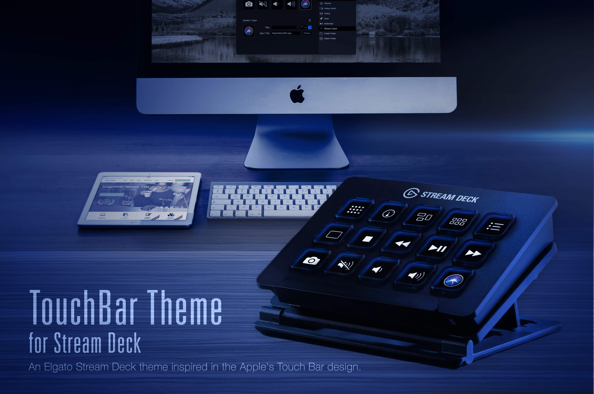

# TouchBar Theme for Elgato Stream Deck

**The TouchBar Theme for Elgato Stream Deck** – Do you like the new Apple Touch Bar
available on the new MacBook Pro? Would you like a Touch Bar on your desktop Mac?
Here's the solution. 

Give not only the appearance of an Apple Touch Bar to your Elgato Stream Deck,
but also functionality, such as shortcuts to frequently used commands and
integration with system apps. (Available only for macOS)

The TouchBar Theme for Elgato Stream Deck, not only adds keyboard shortcuts and
commands for system applications, it also adds support for some third-party
applications, and you can add your own applications as well. You can also contribute
by adding more third party applications to the theme by submitting a pull request.

## Installation
### For macOS
To install TouchBar Theme for Elgato Stream Deck, you must first move or copy the
file "/build/StreamDeckTouchBar.bundle" to
"/Applications/Stream Deck.app/Contents/PlugIns/touchbar/StreamDeckTouchBar.bundle",
you probably require administrator privileges and the system asks you to enter your
administrator password.

After moving the file, go to the "Stream Deck" application and then go to the "Preferences" section, go to the "Profiles" tab and then import the "/build/TouchBarMac.streamDeckProfile" profile.

### For Windows
Windows version coming soon.

## Supported System Applications
### For macOS
- Safari (also supports Chrome)
- Pages
- Numbers
- Keynote
- iTunes
- App Store
- Photos
- iMovie
- GarageBand
- Calendar
- Mail
- Messages
- Terminal

### For Windows
- Windows version coming soon.

## Supported Third-Party Applications
### For macOS
- djay Pro
- Xcode
- GitHub Desktop
- Sublime Text
- PhpStorm
- WebStorm

### For Windows
- Windows version coming soon.

## About the Commands
Most of the commands included in this theme, use Hot Key combinations to work.
All commands in the theme were programmed using the keyboard shortcuts of the
U. S. English keyboard layout, If you want to use the commands with another keyboard
layout, you may need to reprogram some Hot Key combinations.
